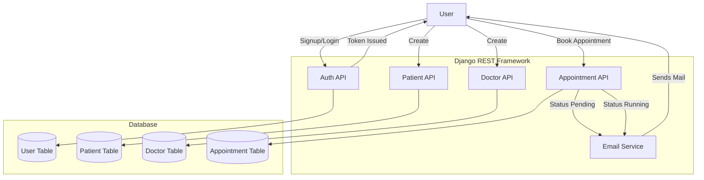

# AH's Healthcare

## Overview:

**AH's Healthcare** a healthcare management system built with Django REST Framework.
This project provides APIs for user registration, email verification, authentication, patient/doctor account management, and appointment scheduling.

---

## Features:
 
  - User registration with email verification
  - Login/Logout with token authentication
  - User profile updates
  - Create & manage patient and doctor accounts
  - Book and manage appointments
  - Email notifications for appointment requests and confirmations
 
---

## System Design:



---

## Technical Specifications:

* **Backend Framework**: Django, Django REST Framework
* **Auth**: Token Authentication
* **Database**: PostgreSQL
* **Email Service**: Django Email + SMTP

## Getting Started:

### Build and Run

1. Clone repo:
   ```bash
   git clone https://github.com/alaminatcs/ah-healthcare.git
   cd ah-healthcare
   ```
2. Create venv:
   ```bash
   # venv for ubuntu
   python3 -m venv uenv
   source ubenv/bin/activate

   # Or windows
   python -m venv wienv
   wienv\Scripts\activate
   ```
3. Install Dependencies:
   ```bash
   pip install -r requirements.txt
   ```
4. Database Settings:
   ```psql
   CREATE USER your_db_user WITH PASSWORD 'your_password';
   CREATE DATABASE your_db_name OWNER your_db_user;
   ```
5. Create .env:
   ```
   # For Database
   SECRET_KEY=your_secret_key
   DB_NAME=your_db_name
   DB_USER=your_db_user
   DB_PASSWORD=your_db_password
   DB_HOST=your_db_host
   DB_PORT=your_db_port
    
   # For Email
   EMAIL_HOST=smtp.gmail.com
   EMAIL_PORT=587
   EMAIL_USE_TLS=True
   EMAIL_HOST_USER=your_host_email
   EMAIL_HOST_PASSWORD=your_email_host_password
   ```
6. Run migrations:
   ```bash
   python manage.py migrate
   ```
7. Create a superuser:
   ```bash
   python manage.py createsuperuser
   ```
8. Run on local browser:
   ```bash
   python manage.py runserver
   ```

---

## API Endpoints:
### Auth
  - [ ] POST /signup/ – User registration (with email verification)
  - [ ] POST /login/ – User login with token
  - [ ] GET /logout/ – User logout
### Patients & Doctors
  - [ ] GET /patient/ – List of patients
  - [ ] POST /patient/ – Create patient account
  - [ ] PUT /patient/{id} – Update patient account
  - [ ] GET /doctor/ – List of doctors
  - [ ] POST /doctor/ – Create doctor account
  - [ ] PUT /doctor/{id} – Update doctor account
### Appointments
  - [ ] POST /appointment/ – Request appointment
  - [ ] PUT /appointment/{id}/ – Update appointment status

---

## Future Enhancements:

-  Role-based access
-  JWT Authentication
-  Frontend integration
-  Add unit & integration tests
-  Dockerize the project
-  and many more...

Stay tuned for updates!
